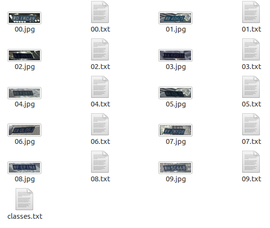

# simpleGeneratePlate
车牌生成程序,  
生成车牌并生成可用于yolov3训练的标签文件  
  
关于如何训练，查看<https://github.com/Feeyao/License-plate-recognition>

  

> 生成的图片和标签文件都位于`./plate`文件夹下  
> classes.txt也位于`./plate`文件下
## 环境
```
python3 
opencv
```

## 支持生成的车牌
- [x] 单行蓝牌
- [ ] 单行黄牌
- [ ] 双层黄牌
- [ ] 大型新能源汽车号牌
- [ ] 小型新能源汽车号牌
- [ ] 白色警用车牌
- [ ] 使馆/港澳车牌
- [ ] 教练车牌

## TODO
- 增加黄牌
- 黄牌增加环境噪声，使其更接近真实环境
